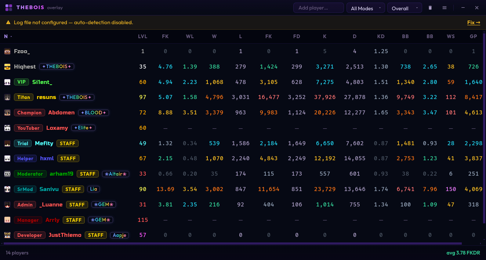

<div align="center">


# THEBOIS Overlay

<br/>

[](../../releases/latest)
[](../../actions/workflows/ci.yml)
[](LICENSE)
[](https://www.electronjs.org/)
[](https://vuejs.org/)
[](https://www.typescriptlang.org/)

<br/>

</div>

---

## Showcase

<p align="center">
  
</p>

---

## Stack

| Layer | Tech |
|-------|------|
| Shell | [Electron 31](https://www.electronjs.org/) |
| UI | [Vue 3](https://vuejs.org/) + [Tailwind CSS v4](https://tailwindcss.com/) |
| State | [Pinia](https://pinia.vuejs.org/) + `pinia-plugin-persistedstate` |
| Routing | [Vue Router 4](https://router.vuejs.org/) |
| Build | [electron-vite](https://electron-vite.org/) + [electron-builder](https://www.electron.build/) |
| HTTP | [Axios](https://axios-http.com/) with semaphore, dedup, retry, and TTL cache |
| Log tailing | [@logdna/tail-file](https://github.com/logdna/tail-file-node) |
| Updates | [electron-updater](https://www.electron.build/auto-update) via GitHub Releases |
| RPC | [discord-rpc](https://github.com/discordjs/RPC) |
| Releases | [semantic-release](https://semantic-release.gitbook.io/) with conventional commits |

---

## Getting Started

```bash
git clone https://github.com/THEBOIS-Dev/THEBOIS-Overlay.git
cd THEBOIS-Overlay
npm install
npm run dev
```

The dev window launches with HMR. The main process reloads on changes to `src/main/`.

---

## Scripts

```bash
npm run dev            # Start with hot reload
npm run build          # Type-check + compile (no packaging)
npm run build:win      # → THEBOIS.Overlay.Setup.x.x.x.exe (NSIS, x64)
npm run build:mac      # → .dmg
npm run build:linux    # → .AppImage

npm run fix            # lint:fix + format in one shot (use before committing)
npm run lint           # ESLint (zero warnings enforced)
npm run lint:fix       # ESLint --fix
npm run format         # Prettier write
npm run format:check   # Prettier dry-run
npm run typecheck      # vue-tsc --noEmit
```

---

## Architecture Notes

**IPC surface** — the renderer never imports Node APIs directly. Everything goes through the context bridge (`window.api`). The bridge is typed in `types/index.ts` via a global `Window` augmentation.

**API client** — `main/index.ts` runs all PikaNetwork requests through a three-layer stack: a TTL cache (60 s) → request deduplication (in-flight map) → a semaphore (16 concurrent max) → Axios with retry (3×, linear back-off).

**State persistence** — `config` and `nicks` stores are persisted to `localStorage` via `pinia-plugin-persistedstate`. `players` is intentionally not persisted; it is cleared on every launch.

---

## CI / Release Pipeline

| Trigger | Workflow | Action |
|---------|----------|--------|
| Push to `main` / `dev` | `ci.yml` | Prettier → ESLint → TypeScript |
| Push to `main` / `dev` | `dependabot-notify.yml` | Dependabot PR notifications |
| Push tag `v*.*.*` | `release.yml` | Build Win + Mac + Linux → publish to GitHub Releases |

Releases are versioned automatically by **semantic-release** from [Conventional Commits](https://www.conventionalcommits.org/). Pushing a tag manually is all that's needed:

```bash
git tag v1.2.3
git push origin v1.2.3
```

> Before your first release, set `build.publish.owner` and `build.publish.repo` in `package.json` to your own GitHub username and repo name.

---

## Auto Updater

`electron-updater` pulls from GitHub Releases. In production, the app checks for updates on launch (if `autoUpdateEnabled` is on), downloads silently, and calls `autoUpdater.quitAndInstall(true, true)` 3 seconds after download completes — restarting into the new version automatically.

Updates are disabled in dev mode (`is.dev` guard in the `updater:check` IPC handler).

---
