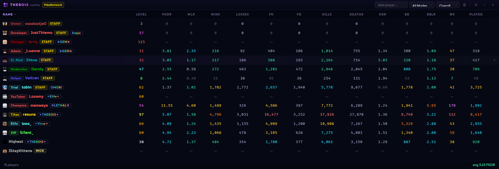
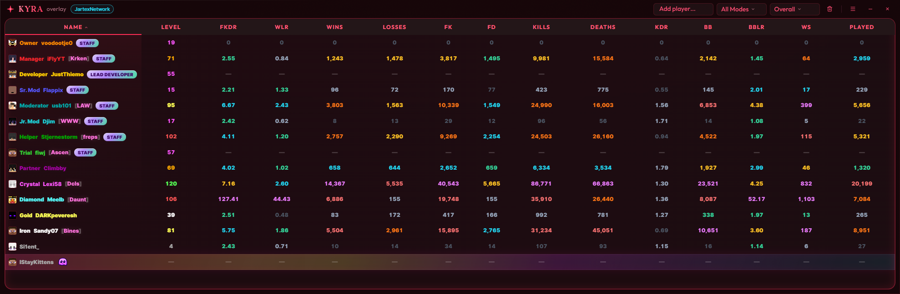

<div align="center">


# THEBOIS Overlay

<br/>

[](../../releases/latest)
[](../../actions/workflows/ci.yml)
[](LICENSE)
[](https://www.electronjs.org/)
[](https://vuejs.org/)
[](https://www.typescriptlang.org/)

<br/>

</div>

---

## Showcase

### PikaNetwork

<p align="center">
  
</p>

### JartexNetwork

<p align="center">
  
</p>

---

## Features

**Stat tracking** — Pulls player profiles and BedWars leaderboard stats from the PikaNetwork and JartexNetwork APIs. Displays FKDR, WLR, BBLR, KDR, wins, kills, final kills, beds broken, win streak, games played, and level. All columns are individually toggleable and sortable.

**Log-based auto-detection** — Tails the active Minecraft log file in real time. Join, quit, `/who`, and final-kill events are parsed and applied to the player list automatically. Supports Lunar Client, Badlion, Feather, Silent, PvPLounge, Salwyrr, CM Client, SK Client, and standard vanilla/TLauncher paths on Windows, macOS, and Linux.

**Transparent proxy with team detection** — A local Minecraft proxy runs alongside the app and intercepts the Minecraft protocol without modifying any packet data. When a client connects through the proxy, the app reads scoreboard team assignments from the server and groups players in the overlay by team — colour-coded per team. The proxy supports every Minecraft version by negotiating the protocol version at connect time rather than hardcoding it.

**Automatic network detection** — When auto-detect is enabled and a client connects through the proxy, the overlay switches the active API (PikaNetwork or JartexNetwork) automatically based on which proxy port was used. Manual selection is always available as a fallback.

**Nick resolution** — Maintains a persistent nick-to-username mapping. Nicked players are flagged visually and their real stats are fetched.

**Clan tags** — Clan membership is fetched separately and displayed inline next to the player name.

**Theme engine** — Full colour, background, gradient, and image theming with per-component CSS variable injection. Resets to a sane default in one click.

**Discord Rich Presence** — Optional Discord RPC integration showing the active network and idle/active state.

**Auto-update** — Downloads and installs new releases from GitHub Releases silently in the background.

---

## Stack

| Layer | Technology |
|-------|-----------|
| Shell | [Electron 42](https://www.electronjs.org/) |
| UI | [Vue 3](https://vuejs.org/) + [Tailwind CSS v4](https://tailwindcss.com/) |
| State | [Pinia](https://pinia.vuejs.org/) + `pinia-plugin-persistedstate` |
| Routing | [Vue Router 5](https://router.vuejs.org/) |
| Build | [electron-vite](https://electron-vite.org/) + [electron-builder](https://www.electron.build/) |
| HTTP | [Axios](https://axios-http.com/) with semaphore, dedup, retry, and TTL cache |
| Log tailing | [@logdna/tail-file](https://github.com/logdna/tail-file-node) |
| Proxy | [minecraft-protocol](https://github.com/PrismarineJS/node-minecraft-protocol) |
| Updates | [electron-updater](https://www.electron.build/auto-update) via GitHub Releases |
| RPC | [discord-rpc](https://github.com/discordjs/RPC) |
| Releases | [semantic-release](https://semantic-release.gitbook.io/) with conventional commits |

---

## Getting Started

```bash
git clone https://github.com/THEBOIS-Dev/THEBOIS-Overlay.git
cd THEBOIS-Overlay
npm install
npm run dev
```

The dev window launches with HMR. The main process reloads on changes to `src/main/`.

---

## Scripts

```bash
npm run dev            # Start with hot reload
npm run build          # Type-check + compile (no packaging)
npm run build:win      # THEBOIS.Overlay.Setup.x.x.x.exe (NSIS, x64)
npm run build:mac      # .dmg
npm run build:linux    # .AppImage

npm run fix            # codemod + typecheck + lint:fix + format (run before committing)
npm run lint           # ESLint (zero warnings enforced)
npm run lint:fix       # ESLint --fix
npm run format         # Prettier write
npm run format:check   # Prettier dry-run
npm run typecheck      # vue-tsc --noEmit
```

---

## Architecture

### IPC surface

The renderer never imports Node APIs directly. All cross-process communication goes through the context bridge exposed as `window.api`. The full API surface is typed in `src/renderer/src/types/index.ts` via a global `Window` augmentation, giving the renderer complete type safety without any runtime coupling to Electron internals.

### API client

`src/main/index.ts` routes all PikaNetwork and JartexNetwork HTTP requests through a four-layer stack:

1. **TTL cache** — 60-second in-memory cache keyed on username + interval + mode. Prevents redundant fetches across panel refreshes.
2. **Request deduplication** — an in-flight map ensures concurrent requests for the same key share one underlying fetch rather than fanning out.
3. **Semaphore** — caps concurrent outbound connections at 16 to stay within the upstream rate limit.
4. **Retry** — up to 3 attempts with linear back-off (1 s, 2 s, 3 s) on 5xx and network errors. 429 responses are surfaced to the UI rather than retried.

### Proxy

`src/main/proxy.ts` implements `BedwarsProxy`, a thin transparent proxy built on `minecraft-protocol`. On startup, two proxy instances are started automatically — one for PikaNetwork on port 25566 and one for JartexNetwork on port 25567 (both configurable in Settings).

When a Minecraft client connects:

1. The proxy performs a standard handshake with the client and records the client's protocol version.
2. An upstream connection to the real server is opened using that same protocol version, so the chain is version-consistent end to end.
3. All packets flow through bidirectionally without modification — the proxy only reads, never writes its own packets.
4. Scoreboard team packets (modes 0–4) are parsed to track team membership and colour. Teams update incrementally as the server sends changes and clear naturally when the server destroys them (e.g. when returning to the lobby after a game). No respawn heuristic is used; the server's own scoreboard lifecycle drives all state transitions.
5. Chat and `system_chat` packets (1.19+) are parsed for join and quit messages to supplement log-based auto-detection.
6. On client disconnect, team state is cleared and the overlay is notified.

Bind errors (port already in use, permission denied) are reported exclusively through `server.on('error')`. There is no pre-flight port availability check, which eliminates the TOCTOU window between checking and binding and keeps the startup path synchronous with respect to the event loop.

The proxy bind address is configurable between `127.0.0.1` (localhost only, the default) and `0.0.0.0` (all interfaces, for LAN use). Switching the bind address restarts both proxy instances atomically.

The server list ping advertises the connecting client's own protocol version back to itself, which prevents Minecraft from displaying a version mismatch indicator in the server list. The label may still appear briefly on the first ping before a connection is established; this is cosmetic only.

### State persistence

The `config` and `nicks` stores are persisted to `localStorage` via `pinia-plugin-persistedstate`. The `players` store is intentionally ephemeral and is cleared on every launch. Proxy connection state (`proxyConnectedNetwork`) is also ephemeral — it reflects the live connection status and is never persisted. The proxy banner dismissed state (`proxyBannerDismissed`) is persisted in config so users do not need to dismiss it on every launch.

### Team display

When team data is present (i.e. at least one player has been assigned to a team by the server), the home view switches from a flat player list to a grouped layout. Each team gets a colour-coded header row showing the team name, player count, and the team's average FKDR. Players without a team assignment (e.g. spectators) are grouped separately under an "Unassigned" section. When no team data is present the flat layout is used unchanged.

---

## Proxy Setup

The proxy starts automatically when the app launches on ports 25566 (PikaNetwork) and 25567 (JartexNetwork). No configuration is required for basic use.

To use team detection:

1. In your Minecraft client, add a new server with the address `localhost:25566` for PikaNetwork or `localhost:25567` for JartexNetwork.
2. Connect through that server entry instead of connecting to the network directly.
3. The overlay will automatically detect the network and populate team assignments as the game starts.

Port numbers can be changed under **Settings → Advanced → Proxy** if the defaults conflict with another local service.

### LAN access

By default the proxy binds to `127.0.0.1` and is only reachable from the same machine. Enabling **Allow LAN access** in Settings switches the bind address to `0.0.0.0`, making both proxy ports reachable from any device on the local network. A warning is shown in Settings while this mode is active. The connect-via address shown in the overlay banner and Settings updates accordingly.

### Auto-detect network

When **Auto-detect via proxy** is enabled (the default), the overlay switches the active API automatically based on which proxy port the client connects through. Disable it to manually control which network's API is queried regardless of proxy connection.

### Proxy not connected banner

A banner is shown on the home screen when no client is connected through the proxy. It displays the address and port to connect to and links directly to proxy settings. The banner can be permanently dismissed using the × button; it will reappear if the bind host is changed (since the connection address changes).

---

## CI / Release Pipeline

| Trigger | Workflow | Action |
|---------|----------|--------|
| Push to `main` / `dev` | `ci.yml` | Prettier → ESLint → TypeScript |
| Push to `main` / `dev` | `showcase.yml` | Capture and commit showcase screenshots |
| Push to `main` / `dev` | `dependabot-notify.yml` | Dependabot PR notifications |
| Push tag `v*.*.*` | `release.yml` | Build Win + Mac + Linux → publish to GitHub Releases |

Releases are versioned automatically by **semantic-release** from [Conventional Commits](https://www.conventionalcommits.org/). Pushing a tag is all that is needed:

```bash
git tag v1.2.3
git push origin v1.2.3
```

Before your first release, set `build.publish.owner` and `build.publish.repo` in `package.json` to your own GitHub username and repository name.

---

## Auto-updater

`electron-updater` pulls from GitHub Releases. In production, the app checks for updates on launch when `autoUpdateEnabled` is on, downloads silently in the background, and calls `autoUpdater.quitAndInstall(true, true)` three seconds after the download completes, restarting into the new version automatically.

Updates are disabled in dev mode via an `is.dev` guard in the `updater:check` IPC handler.

---

## Log File Paths

The overlay ships with preset paths for every supported client. The auto-detection heuristic for Lunar Client scans all version subdirectories under the Lunar offline directory and picks the most recently modified `latest.log`.

| Preset | Path (Windows `%APPDATA%`) |
|--------|---------------------------|
| Standard / TLauncher | `.minecraft\logs\latest.log` |
| Lunar Client | Detected automatically |
| Badlion Client | `.minecraft\logs\blclient\minecraft\latest.log` |
| Feather Client | `.minecraft\feather\logs\latest.log` |
| Silent Client | `.mc\logs\latest.log` |
| PvPLounge | `.pvplounge\logs\latest.log` |
| Salwyrr | `.salwyrr\logs\latest.log` |
| CM Client | `.cmclient\logs\latest.log` |
| SK Client | `.minecraft\logs\latest.log` |

macOS and Linux paths follow the same relative structure under `~/Library/Application Support` and `~` respectively.
